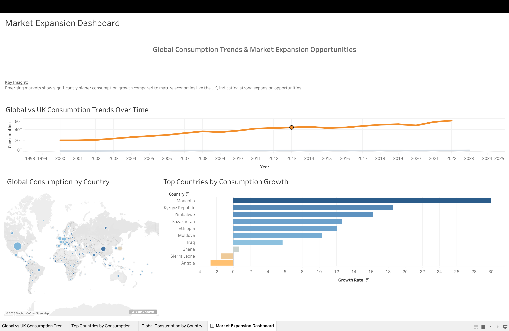

# Global Consumption Trends for Market Expansion Strategy

## Objective  
This project analyses global consumption trends using World Bank data to identify high-growth markets and support business expansion decisions.  

The analysis simulates a real-world scenario where a company evaluates which regions offer the strongest opportunities for growth based on consumer spending patterns.

---

## Business Questions  
- Which countries show the strongest growth in consumer spending?  
- How does the UK compare to global consumption trends?  
- Which regions present the best opportunities for expansion?  
- Are there markets showing declining or stagnant consumption?  
- How can economic indicators guide strategic decisions?  

---

## Key Metrics Analysed  
- Household final consumption expenditure  
- Consumption growth rate over time  
- UK vs global consumption comparison  
- Year-on-year growth trends  

---

## Data Cleaning and Preparation  
- Extracted data from the World Bank API (JSON format)  
- Cleaned and structured raw data  
- Handled missing values and inconsistencies  
- Standardised time-series data  
- Applied transformations (including log scaling)  

---

## Tools and Technologies  
- Python (pandas, matplotlib)  
- REST API (World Bank Open Data)  
- Data visualisation  
- Time-series analysis  

---

## Analysis and Key Insights  

### Global Consumption Growth Outpaces the UK  
Global consumption has increased significantly over time, while UK growth remains steady but slower.  

**Business implication:** Faster-growing markets may offer stronger expansion opportunities than mature economies like the UK.  

---
## Dashboard

This dashboard highlights global consumption trends and identifies high-growth markets for business expansion.



### Mature vs Emerging Market Trends  
The UK represents a stable economy, whereas global trends reflect higher growth driven by emerging markets.  

**Business implication:** Businesses should consider expanding into higher-growth regions rather than relying solely on established markets.  

---

### Long-Term Growth Patterns  
Consumption trends show consistent upward movement globally, indicating increasing purchasing power.  

**Business implication:** Long-term economic growth supports sustained expansion opportunities.  

---


---

## Recommendations  
- Prioritise expansion into high-growth markets  
- Use consumption trends to guide market selection  
- Monitor emerging markets for early opportunities  
- Balance stable and high-growth regions for risk management  

---

## Executive Summary  
Global consumer spending is growing faster than in the UK, largely driven by emerging markets. Businesses should focus on regions with increasing consumption while maintaining a balance between stability and growth.

---

## Business Impact  
This project demonstrates how data analysis can:  
- Support strategic decision-making  
- Identify growth opportunities and risks  
- Translate data into actionable insights  

---

## How to Run  

```bash
python3 notebooks/analysis.py

